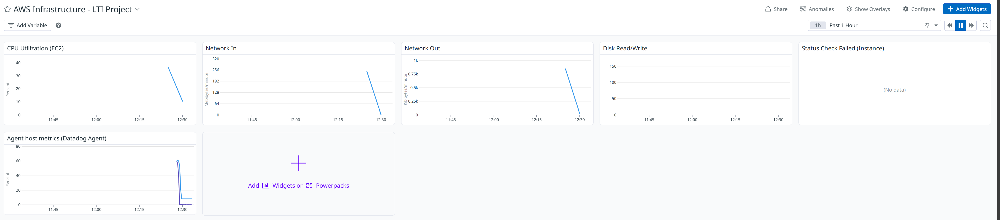

# Terraform: Integración Datadog con AWS

Este directorio contiene la infraestructura como código (Terraform) para el proyecto LTI, incluyendo la **integración de Datadog con AWS** y el despliegue de instancias EC2 con el agente Datadog instalado.

## Cambios realizados

### 1. Configuración del proveedor Datadog (EU1)

- **`provider.tf`**: Bloque `terraform` con proveedores `aws` y `datadog`, y configuración del proveedor Datadog con `api_url = "https://api.datadoghq.eu"` (sitio **EU1**, datadoghq.eu).
- **`variables.tf`**: Variables `datadog_api_key` y `datadog_app_key` (sensitivas), pensadas para ser inyectadas con `TF_VAR_datadog_api_key` y `TF_VAR_datadog_app_key`.

### 2. Integración AWS–Datadog

- **`datadog_integration.tf`**: Configuración de la integración oficial AWS–Datadog según [docs.datadoghq.com/integrations/guide/aws-terraform-setup](https://docs.datadoghq.com/integrations/guide/aws-terraform-setup):
  - Rol IAM `DatadogIntegrationRole` en tu cuenta AWS con política de confianza que permite a la cuenta de Datadog (EU, `464622532012`) asumir el rol usando un `external_id` generado por Datadog.
  - Políticas IAM basadas en `datadog_integration_aws_iam_permissions` (permisos recomendados por Datadog), fragmentadas para no superar el límite de tamaño de políticas.
  - Recurso `datadog_integration_aws_account` que enlaza tu cuenta AWS con Datadog (métricas, logs, traces, extended collection).

Así Datadog puede recoger métricas de CloudWatch, EC2, etc., desde tu cuenta AWS sin claves estáticas.

### 3. Agente Datadog en EC2

- **Scripts de user data** (`scripts/backend_user_data.sh`, `scripts/frontend_user_data.sh`):
  - Instalación del agente Datadog 7 con el script oficial.
  - Uso de variables de plantilla `${dd_api_key}` y `${dd_site}` (sin claves hardcodeadas).
  - `DD_SITE=datadoghq.eu` para el sitio EU1.
- **`ec2.tf`**: Las instancias backend y frontend usan `templatefile()` pasando `dd_api_key = var.datadog_api_key` y `dd_site = "datadoghq.eu"` a los scripts.

Cada nueva instancia que arranque con estos scripts tendrá el agente instalado y enviando métricas a Datadog EU1.

### 4. Dashboard en Datadog

- **`datadog_dashboard.tf`**: Dashboard **"AWS Infrastructure - LTI Project"** con widgets para:
  - CPU (EC2 y sistema desde el agente).
  - Tráfico de red (entrada/salida EC2).
  - Operaciones de disco (EC2).
  - Status check failed (EC2).
  - Métricas de host del agente (`system.cpu.user` por host).

### 5. Salidas útiles

- **`outputs.tf`**:
  - `backend_instance_id` / `frontend_instance_id`: IDs de las instancias EC2.
  - `datadog_dashboard_url`: Enlace al dashboard en **app.datadoghq.eu**.
  - `datadog_aws_integration_role`: Nombre del rol IAM de la integración.

### 6. Limpieza en `main.tf`

- **`main.tf`**: Se eliminó la configuración de proveedores, variables, la política IAM antigua (`DatadogPolicy`) y el dashboard; todo ello está en los ficheros anteriores para mantener una estructura clara.

## Cómo usar

1. **Exportar claves de Datadog** (EU1):
   ```bash
   export TF_VAR_datadog_api_key="<tu-api-key>"
   export TF_VAR_datadog_app_key="<tu-app-key>"
   ```
2. **Inicializar y aplicar** desde el directorio `tf/`:
   ```bash
   cd tf
   terraform init
   terraform plan
   terraform apply
   ```
3. Tras el apply, usar el output `datadog_dashboard_url` para abrir el dashboard en **app.datadoghq.eu**.

## Referencias

- [Datadog Terraform Provider](https://registry.terraform.io/providers/DataDog/datadog/latest/docs)
- [Integración AWS con Datadog](https://docs.datadoghq.com/integrations/amazon_web_services/?tab=allpermissions)
- [Configuración AWS con Terraform (Datadog)](https://docs.datadoghq.com/integrations/guide/aws-terraform-setup/)
- [Gestionar Datadog con Terraform (blog)](https://www.datadoghq.com/blog/managing-datadog-with-terraform/)


## Dashboard generado

